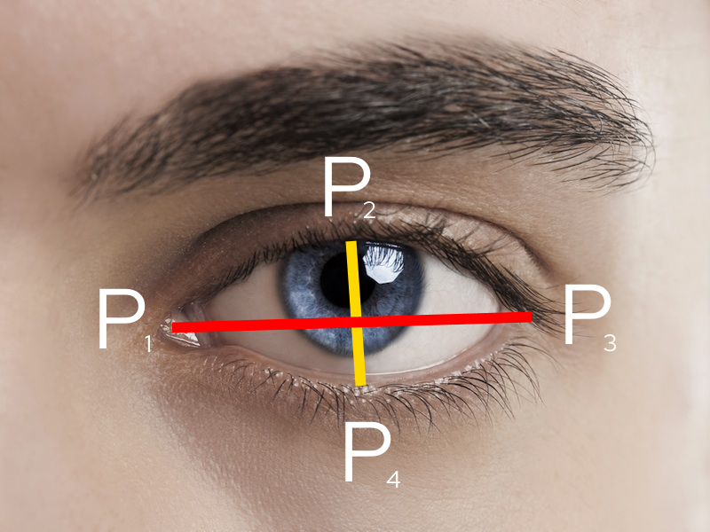
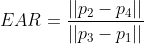

import MDLayout from '../components/mdLayout'

# Sleepiness Detectin System: About and complete guide

#### By Bikram Oli

##### "Don't let your eyes get closed while you are driving" - Bikram

## What is Sleep detection system?

Focus is a web-based utility to detect sleepiness of driver and avoid car accidents.
It detects and alerts both drivers and vehicle systems to potential sleepiness - helping to prevent accidents.
This software is built to be easily ported to older vehicle independent of a "central compute unit" or a newer vehicle with one

## Why?

When you are rolling down the highway in a two-ton death machine, the last thing you wanna do is take your eyes off the road or fall asleep.
This program prevents and alerts drivers/vehicles to possible sleepiness, preventing possible accidents.

## What technologies does it use?

We use GatsbyJS with theme-ui for our frontend visuals. We also combine framer motion, for fancy animations

For face landmark detection, we use tensorflowjs.
We chose google's library over others since it has a relatively accurate, small, and therefore quick model, making it perfect for low-cost hardware.
We've also chosen the WASM backend for tf.js considering that it performs better than WebGL on low-end devices, and about the same on medium-higher performance hardware.

## How does the sleepiness detection work?

We take the ratio of the height of one's eyes, compared to the length.
Because for most people, eyes are longer than the height, the resulting ratio is 99% of the time a value from 0-1.

Here's a diagram and equation describing the calculation of the ratio, which is called **EAR**.

### Diagram

### Equation

Our ratio is similar to the one from here: [Real-Time Eye Blink Detection using Facial Landmarks](https://www.semanticscholar.org/paper/Real-Time-Eye-Blink-Detection-using-Facial-Soukupov%C3%A1-%C4%8Cech/4fa1ba3531219ca8c39d8749160faf1a877f2ced).
However, the main difference for ours is that we only use one vertical line for our aspect ratio. This is fine since the tf.js model is incredibly stable, and it _very slightly_ improves perf (but it's probably not noticable at all).

You may worry that the drowsiness detection is extremely volative, but don't worry. From our testing, Google's face landmarks models are surprisingly extremely stable, even accurate
across a large range of head angles.

## I hoped you enjoyed this project!

export default MDLayout
